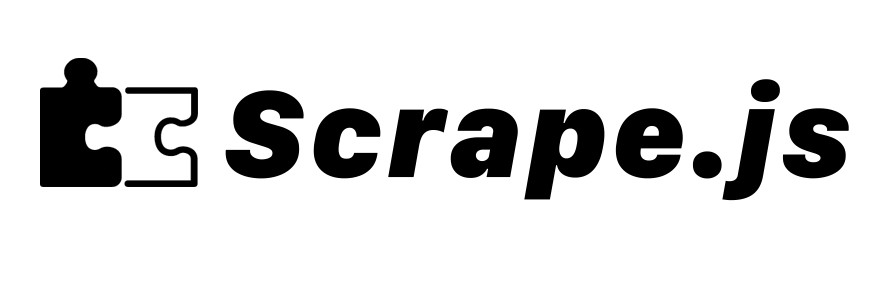

## Scrape.js



<div class="badges" style="text-align: center; margin-top: -50px;">
<a href="https://github.com/themaximal1st/scrape.js"></a>
<a href="https://www.npmjs.com/package/@themaximalist/scrape.js"></a>
<a href="https://github.com/themaximal1st/scrape.js"></a>
<a href="https://github.com/themaximal1st/scrape.js"></a>
</div>
<br />

`Scrape.js` is an easy to use web scraping library for Node.js.

```javascript
const data = await scrape("https://example.com");
// { url, html }
```

**Features**

* Fast
* Scrape nearly any website
* Headless JavaScript scraping
* Auto proxy rotation
* ...it just works
* MIT License


## Install

Install `Scrape.js` from NPM:

```bash
npm install @themaximalist/scrape.js
```

## Config

`Scrape.js` uses [Zen Rows](https://www.zenrows.com/) for proxy rotation. To use it acquire a Zen Rows API key and setup the environment variable.

```bash
ZENROWS_API_KEY=abcxyz123
```

`Scrape.js` can be used without proxies, but is less effective.


## Usage

Using `Scrape.js` is as simple as calling a function with a website URL.

```javascript
const scrape = require("@themaximalist/scrape.js");
await scrape("http://example.com"); // { url, html }
```

You can specify additional options to `scrape()` for more control:

```javascript
const data = await scrape("https://example.com", {
    headless: true,
    proxy: true
});
// { url, html }
```

## API

The `Scrape.js` API is a simple function you call with your URL, with an optional config object.


```javascript
await scrape(
    url, // URL to scrape
    {
        headless: true, // Use JavaScript headless scraping
        proxy: true, // Use proxy rotation
        method: "GET", // HTTP Request method
        timeout: 3000, // Scrape timeout in ms
        userAgent: "Mozilla/5.0...", // User Agent
    }
);
```

**URL (required)**

* **`url`** `<string>`: URL to scrape

**Options**

* **`headless`** `<bool>`: Enable JavaScript. Default is `true`.
* **`proxy`** `<bool>`: Use proxy with request. Default is `true`.
* **`method`** `<string>`: HTTP request method, usually `GET` or `POST`. Default is `GET`.
* **`timeout`** `<int>`: Max request time in ms. Default is `3500`.
* **`userAgent`** `<string>`: User agent for request. Default is `Mozilla/5.0 (Macintosh; Intel Mac OS X 10_15_7) AppleWebKit/537.36 (KHTML, like Gecko) Chrome/112.0.0.0 Safari/537.36`.

**Response**

`Scrape.js` returns an `object` containing the final `url` and `html` content.

```javascript
const { url, html } = await scrape("https://example.com");
console.log(url); // https://example.com/
console.log(html); // <html...
```

The `Scrape.js` API is a simple and reliable way to scrape the HTML from any website.

## Debug

`Scrape.js` uses the `debug` npm module with the `scrape.js` namespace.

View debug logs by setting the `DEBUG` environment variable.

```bash
> DEBUG=scrape.js*
> node src/get_website_html.js
# debug logs
```


## Examples

View [tests](https://github.com/themaximal1st/scrape.js/tree/main/test) to examples on how to use `Scrape.js`.


## Projects

`Scrape.js` is currently used in the following projects:

-   [News Score](https://newsscore.com) — score the news, score the news, rewrite the headlines


## License

MIT


## Author

Created by [The Maximalist](https://twitter.com/themaximal1st), see our [open-source projects](https://themaximalist.com/products).

